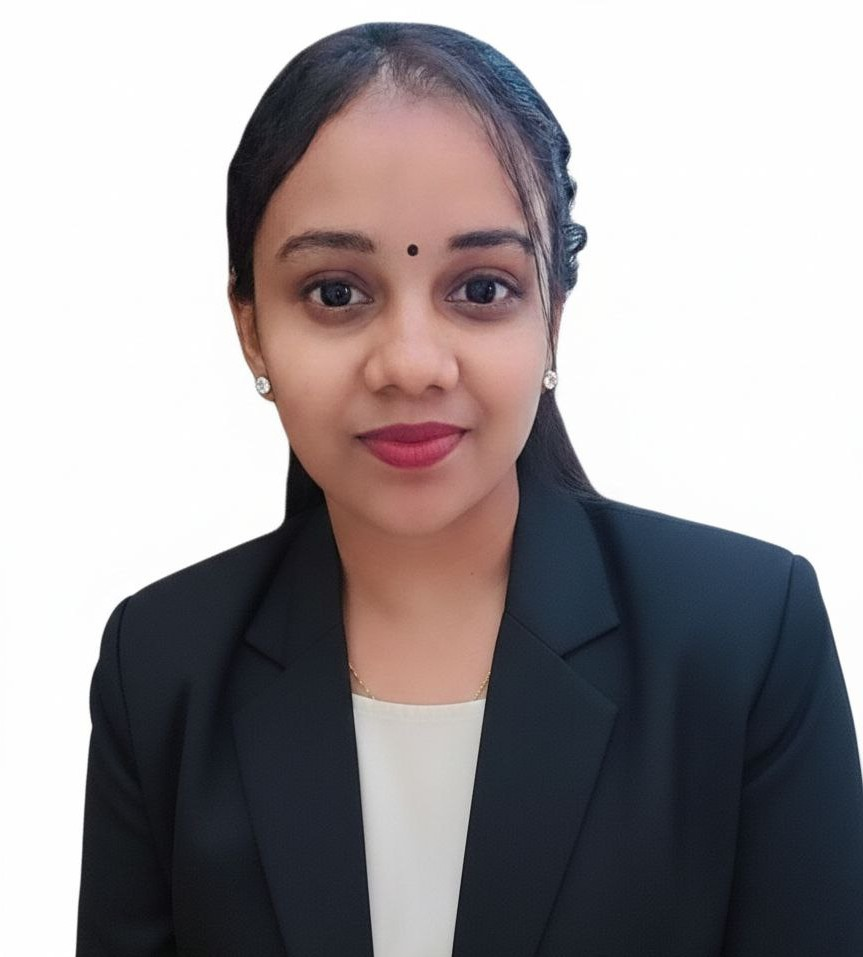

<h1 align="center">Hi 👋, I'm Nithia</h1>
<h3 align="center">Master's Student in Software Engineering | University of Malaya</h3>

---

## 👩‍💻 About Me

🎓 I am currently pursuing a **Master's degree in Software Engineering** at **University of Malaya**.

📚 I am taking the course **Framework-Based Software Design and Development**, where I aim to learn how modern frameworks help developers build scalable and efficient applications.

👩‍🏫 Besides studying, I am also a **teacher**, and I enjoy helping students explore technology and digital skills.

---

## 💡 Interests

- Web Application Development  
- Software Frameworks  
- Software Architecture  
- Learning Modern Development Tools  
- Technology in Education  

---

## 🎯 Expectations for This Course

Through this course, I hope to:

- Understand **framework-based software architecture**
- Learn how modern frameworks simplify development
- Gain practical experience building structured applications
- Improve my knowledge of **software design and development practices**

---

## 🌱 Currently Learning

- Framework-Based Software Development
- Git and GitHub Version Control
- Modern Software Development Practices

---

## 🛠️ Languages and Tools

---

## 📊 GitHub Stats

---

## 🔥 GitHub Streak

---

## ✨ Fun Fact

I enjoy exploring new technologies and digital tools that make learning and teaching more effective.

---

## 📷 About Me

